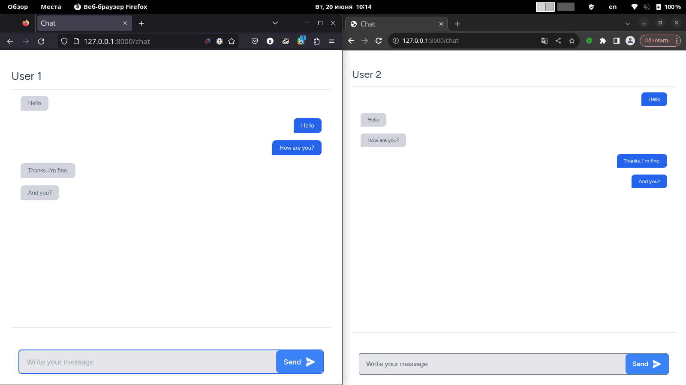

# laravel-chat

Private chat example.



## Install

```sh
composer install
npm install

npm run build
cp .env.example .env
php artisan key:generate
php artisan migrate
```

## Usage

```sh
php artisan serve
```
